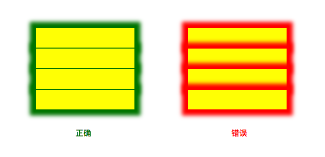
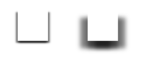
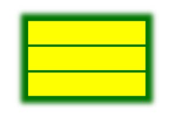

# 同级元素box-shadow相互覆盖解决方案
案例：列表中N个带有相同阴影属性元素，使阴影不遮盖前方元素。

**代码结构**
```html
<ul>
  <li></li>
  <li></li>
  <li></li>
</ul>
```

如下图所示，左侧为期望效果，右侧为未处理效果。

**示例图**


## 原因
由于元素顺序导致后方元素样式对前方样式的覆盖。

## 解决方案
目前只提供了三个解决方案，将按照思考过程中的出现顺序依次介绍。

### 单边阴影（不完美）
由于是`box-shadow`产生的效果，在思考时第一个想到的方案其实是利用阴影的多值设置来实现对某一边的隐藏。
```css
{
  box-shadow: 
    inset x-offset y-offset blur-radius spread-radius,
    inset x-offset y-offset blur-radius spread-radius, 
    ...;
}
```

但这个方案存在一个很严重的问题就是由于位移隐藏而导致阴影效果很不自然（模糊半径较小时不明显），此外在列表中处理时需要区分首/中/尾三类元素，极其繁琐。

**代码结构**
```html
<div style="box-shadow:
  0 3px 3px 0 rgba(0,0,0,0.5),
  3px 3px 3px 0 rgba(0,0,0,0.5),
  -3px 3px 3px 0 rgba(0,0,0,0.5)
"></div>
```

如下图，当阴影半径较大时，底部阴影颜色偏重，可以通过调整色值规避但会更加麻烦。

**示例图**


### 阴影截断（不完美）
上一方案被抛弃的主要原因是代码书写非常繁琐，需要对不同位置元素区别设置阴影。因此此方案通过在外层包裹一个元素，通过`overflow: hidden`截断的方式进行设置。不仅可以轻松解决阴影颜色偏重的问题，而且不用区别设置阴影。**最关键的是在两个元素阴影重叠部分不会出现颜色加重现象**

```html
<ul>
  <li><div></div></li>
</ul>

<style>
ul li{overflow: hidden;padding: 2px 36px;margin: 0;}
ul li:first-child{padding-top: 36px;}
ul li:last-child{padding-bottom: 36px;}
ul li div{display: block;height: 100%;background: yellow;box-shadow: 0px 0px 12px 12px green;}
</style>
```

虽说这个方案需要对首尾元素进行特殊处理，但是相比上一个方案要简单许多。不过，既然有三个方案，同样它也存在着一些问题。首先就是增加的截断元素比实际显示区域要更大，在进一步应用时（拖拽计算位置等）比较棘手，而且也于我个人对于修饰样式不对其本身带来副作用的原则不符。此外，由于当列表的间距为不定值时，截断元素的`padding`就不能很好的达到希望的效果了。
当然，这个方案还是有一定可取之处，尤其是场景确定且没有复杂交互时，可以完美的达到期望效果（阴影重叠部分颜色统一）。当然，这种情况很有可能直接在`ul`设置`box-shadow`来做了。

**示例图**



### z-index覆盖（最适合）
其实出现问题第一个想到的解决方案就应该是设置`z-index`的值，毕竟问题也是因此而起的嘛。要好好反思一下睡眠不足导致智商跳崖的问题了。闲话不多说，直接上代码。

```html
<ul>
  <li><div></div></li>
</ul>

<style>
ul li{margin: 2px;box-shadow: 0px 0px 12px 12px green;}
ul li div{position: relative;background: yellow;}
</style>
```

解决方案极其简单，将内容（背景色）独立成节点，通过相对定位提升层级。除了新增节点对整体影响基本为零。当然，对于洁癖来说这个怎么能忍呢？所以请继续阅读几行：

```html
<ul>
  <li></li>
</ul>

<style>
ul li{position: relative;background: yellow;margin: 2px;}
ul li:after{content: '';position: absolute;z-index: -1;top: 0;left: 0;width: 100%;height: 100%;box-shadow: 0px 0px 12px 12px green;}
</style>
```

伪元素`after`模拟本身区域进行阴影设置，原结构完全不增不减，哦对，相对定位不算，本身就有啦。

**示例图**
已经在你的脑海中呈现了吧（没有的话返回顶部看左侧正确示例～）
这个方案有点麻烦的就是阴影重叠部分会有小小的突出，不过实际使用中没有这么玩的，所以可以说是最适合的方案。
那放一个真实效果吧～


突然有种一顿操作猛如虎，一看数据零扛五的感觉呢？不过重要的是自己给自己制造困难也要上的勇气，你们说对吧？

## 总结
其实就是要反思一下为什么会做了两个解决办法后才回到本应第一个就想到的方案上，白白浪费大把时间。所以说大家要注意休息，保持充沛的精神才能快速的写好代码！